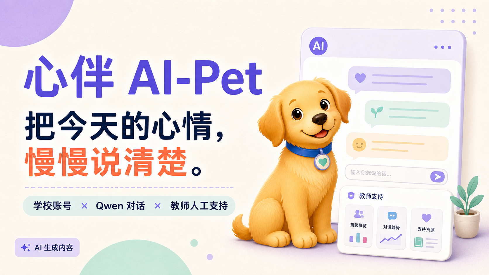

# 心伴 AI-Pet v5.3.2

v5.3.2 同时保留两条公开演示路径：`/login` 提供完整学生／教师界面，18 岁以上测试者使用固定虚构账号体验合成心情、Qwen 对话、语音和模拟处置；`/evaluate` 供成年教师／专家评价固定合成案例与冻结 AI 输出。两条路径有清晰的双向入口，学校域记录仍强制 `synthetic=1`，评估记录保存在独立表中；这不是向真实学生开放。

v5.3.1 是成人合成学校沙盒的线上兼容修复版。它把密码派生升级为带版本标记的三段串行 KDF：总工作因子保持 210,000 次，但每次 PBKDF2 调用为 70,000 次，以适配 Sites/workerd 单次 PBKDF2 不得超过 100,000 次的运行限制。线上独立合成沙盒已经成功初始化 1 个虚构教师、1 个合成班级和 3 个固定情境学生；学生登录、教师登录及模拟安全队列均已验证。当前线上环境尚未配置 Qwen 服务端密钥，因此不得声称 AI 对话、ASR 或 TTS 已在线验证成功；未配置时这些链路失败关闭。

本版本仍然**只允许 18 岁以上成人使用完全合成的数据扮演虚构角色**。它不是面向真实未成年人的公开试点，沙盒运行记录也不是学生效果或干预效果证据。

v5.3.0 是 **18 岁以上成人操作的合成学校沙盒**。它保留虚构学生账号、心情记录、15 分钟或 12 轮 Qwen 对话、ASR/TTS 和模拟教师处置，供作者、教师与专家使用固定虚构情境检查完整产品流程。所有学校域记录必须标记为 `synthetic=1`；登录前必须确认已成年且只使用合成信息；疑似真实姓名、学校、班级、学号、电话、邮箱、地址或账号信息会在保存或发送给文本模型前被拒绝。沙盒记录不进入 `/evaluate` 的成人研究评价表，也不能作为学生效果或干预效果证据。

启用沙盒必须同时保持 `ADULT_EVALUATION_ONLY=true`、显式设置 `SANDBOX_MODE=true`，使用独立空数据库，并把至少 24 字符的 `SANDBOX_ADMIN_KEY` 只放在服务端 Secret。部署管理员通过受保护的 `/api/sandbox/bootstrap` 一次性生成 1 个虚构教师、1 个合成班级和 3 个固定情境学生账号；凭据只在成功响应中显示一次。旧的学校模式和 v5.2.0 成人评价版均作为独立历史版本保留。

v5.2.0 新增“成人教师/专家形成性评估”路径：公开演示保持
`PUBLIC_DEMO_MODE=true`，不创建真实学生账号；`/evaluate` 仅使用 12 个固定
合成学生情境，收集成年教师与专家自愿提交的匿名判断、评分、用时和可选反馈。
`/research` 只显示达到 N≥5 的真实成人汇总，不预填虚假统计。成人评价能否作为
论文研究结果，仍取决于适用的伦理/机构审批；未获批准时只能称原型形成性反馈。

阿里云 Node + RDS PostgreSQL 候选部署说明见
`docs/aliyun-v5.1-deployment.md`。一次性教师/专家邀请码和研究者密钥分别使用
`EVALUATION_TEACHER_CODES`、`EVALUATION_EXPERT_CODES`、`RESEARCH_ACCESS_KEY`，
只能写入服务端 Secret，不能放进链接、浏览器代码或 Git 仓库。

面向中国中小学生设计的每日心情记录、短时 AI 陪伴与真人支持研究系统。当前 **v5.3.2** 仅开放给成人使用合成账号和虚构情境测试；v5.3.1、v5.3.0、v5.2.0 及 v5.0.0 均作为独立历史版本保留。当前沙盒不代表已获准向未成年人公开招募或投入常态化使用。

> 学生自我记录 × AI 低压力回应 × 教师最少必要支持线索

AI 只用于倾听、梳理和提供小步骤，不是心理测评、诊断、治疗、自动转介或紧急服务。论文或演示可以使用虚构、脱敏测试账号；未经学校与伦理审批、监护人同意和学生本人知情同意，不得直接收集真实未成年人的数据。



## v5.0.0 实现了什么

- 学生使用学校发放的匿名用户名和临时密码登录，不公开注册，也不要求提交手机号。
- 部署负责人使用一次性 `AUTH_BOOTSTRAP_TOKEN` 建立首位教师账号；数据库中出现首位教师后，初始化入口永久关闭。
- 教师创建本班、配置现实中的安全联系人，并创建、停用或重置本班学生账号；学生首次登录必须修改临时密码。
- 教师核验监护人同意后，学生还必须阅读并确认本人知情同意，才能提交心情、调用 AI 或使用语音。
- 学生可以与明确标注为 AI 的 Qwen 心伴连续对话。每段会话最多 **15 分钟或 12 个学生回合**，达到任一限制即结束。
- Qwen 文本、ASR 语音转写和 TTS 主动朗读均通过服务端调用；不使用声音克隆，不自动播放，音频不写入 D1。
- 账号、班级、同意状态、心情记录、对话和最少必要安全事件保存到真实 D1 数据库；未配置数据库或模型时接口失败关闭，不用虚构响应冒充真实结果。
- 高风险表达先经过本地确定性规则，命中后不发送给外部模型，普通 AI 对话立即结束，并生成供真人核对的结构化安全事件。
- 教师只能读取自己班级的聚合趋势、学校账号状态、学生主动支持请求和结构化安全事件；不提供普通聊天原文，也不提供心情备注或目标原文。

GitHub Pages 只用于[历史版本选择和固定静态归档](https://ling20251121.github.io/xinban-ai-pet/)。静态页不连接 Qwen、D1 或麦克风，不能作为 v5 真实系统入口。真实系统必须部署在具有服务端密钥、D1 绑定和访问控制的全栈环境中。

## 受控账号流程

1. 部署负责人配置服务端密钥、D1 和一次性初始化令牌。
2. 首位教师在登录页完成一次性初始化并登录。
3. 教师创建班级，填写学校已有的真人安全联系人及电话。
4. 教师为学生发放不包含姓名、学号、手机号或可识别昵称的用户名和临时密码，并选择年龄段。
5. 学生首次登录后修改密码。14 周岁以下学生必须先由学校核验监护人同意；其他年龄段也应按研究方案完成适用的监护人和学校程序。
6. 学生阅读边界并确认本人知情同意后，才可记录心情、开始 AI 会话和主动使用语音。

当前实现是学校用户名与密码，不是“手机号 + 验证码”。这样可以避免为研究原型额外收集学生手机号和承担短信服务、实名关联及验证码滥用风险。若学校以后要求短信登录，应在独立的身份认证与隐私评估后接入，而不是把短信凭据写进前端。

## 学生数据权利与删除边界

- 学生只能查看本人的心情记录和对话；教师不能读取普通聊天原文。
- 学生可将本人的对话导出为 JSON，也可以删除一段或全部本人对话；心情记录可以查看和删除。
- 撤回学生同意会立即停止新的心情写入、AI 对话、语音转写和云端朗读，撤销当前登录会话并退出。
- **撤回同意不等于删除数据。** 既有心情和对话不会自动删除；重新验证学校账号后，读取、导出和删除本人既有数据的服务端权利仍保留。
- 删除对话或心情原文不会同时抹去已经生成的最少必要安全事件。安全事件只保留事件码、来源、时间、账号、班级和处置状态，不含聊天、备注或目标原文；其保存期限和删除规则必须由获批的学校研究方案明确。

## 教师端与安全事件的真实边界

教师端按班级显示聚合数据和人工核对队列。队列通过教师页面的请求、刷新或轮询读取，**不是短信、电话、微信、邮件或系统推送送达通知**，也不能证明老师已经看到或已联系学生。只有教师在工作台主动标记“已看到”或“已完成核对”，系统才记录相应状态。

因此，正式试点必须另有真实值守安排、送达确认、超时升级、节假日预案和紧急联系人流程。界面中的安全队列不能替代学校既有危机处置渠道；紧急危险应立即联系身边可信任成人，并拨打 110 或 120。

## Qwen 模型链路

v5 只启用经本项目审查的阿里云百炼北京地域 Qwen 路径，并固定模型快照以便研究复现：

```env
AI_PROVIDER=qwen
QWEN_API_KEY=
QWEN_BASE_URL=https://YOUR_WORKSPACE_ID.cn-beijing.maas.aliyuncs.com/compatible-mode/v1
QWEN_MODEL=qwen3.7-plus-2026-05-26
QWEN_ASR_MODEL=qwen3-asr-flash-2026-02-10
QWEN_TTS_MODEL=qwen3-tts-instruct-flash-2026-01-26

# 至少 24 个字符，仅用于创建首位教师，成功一次后数据库永久关闭初始化
AUTH_BOOTSTRAP_TOKEN=
```

真实值只放在部署平台的服务端 Secret 中。任何曾在聊天、截图、文档或终端输出中出现过的 API Key 都必须先撤销并重新生成；不得把密钥写入浏览器代码、`localStorage`、Git 仓库、`NEXT_PUBLIC_*` 或 `VITE_*` 变量。

后端只接受固定的模型快照和受允许的 HTTPS 阿里云北京域名。普通聊天最多向 Qwen 发送最近 6 对用户/助手消息，并在出站前再次移除常见手机号、证件号、邮箱、网址和带标签的姓名、学校、地址信息。学校用户名从不发送给模型。模型位于北京地域并不自动证明端到端数据都在中国内地，正式试点仍需审查应用运行节点、日志、供应商协议和跨境传输路径。

官方参考：

- [阿里云百炼地域与部署范围](https://help.aliyun.com/zh/model-studio/regions/)
- [Qwen3.7 Plus](https://help.aliyun.com/zh/model-studio/qwen3-7-plus)
- [Qwen3-ASR API](https://help.aliyun.com/zh/model-studio/qwen-asr-api-reference)
- [Qwen3-TTS Instruct Flash](https://help.aliyun.com/zh/model-studio/qwen3-tts-instruct-flash)

## 本地运行与数据库

需要 Node.js 22.13 或更高版本，以及 pnpm 11：

```bash
pnpm install
pnpm run dev
```

以 `.env.example` 为字段清单创建本地服务端配置，但不要提交真实值。不要从其他版本复制已废弃的 `PARTICIPANT_HASH_PEPPER` 或 `TEACHER_ACCESS_KEY` 共享密钥方案；v5 使用学校账号、密码哈希和服务端会话令牌。

D1 的 v5 迁移位于 `drizzle/0001_controlled_school_system.sql`。部署前应先在独立测试数据库验证迁移和回滚预案，再对获批环境执行。项目使用 vinext、Cloudflare Workers 兼容输出、D1 与 Drizzle；部署配置位于 `.openai/hosting.json`。

常用校验命令：

```bash
pnpm run lint
pnpm run build
pnpm test
```

测试覆盖服务端渲染、匿名访问拒绝、跨来源写入拒绝、v4 到 v5 数据迁移、一次性教师初始化、班级权限隔离、学生首次改密与同意门槛、真实 D1 读写、本地危机拦截、对话轮次限制和学生之间的数据隔离。

## 正式未成年人研究前的门槛

本仓库是 EITT 2026 研究系统候选版，不是公开招募页面。向真实学生发放链接和账号前，至少必须完成：

- 学校管理、伦理与信息安全审批，并限定研究目的、样本、周期和负责人；
- 监护人单独同意与学生本人知情同意，尤其完成 14 周岁以下学生的监护人核验；
- 儿童个人信息规则、最小化字段、保存期限、访问审计、撤回、导出、删除和事件留痕政策；
- 教师值守、安全联系人、真实送达确认、超时升级、节假日和紧急处置预案；
- Qwen 供应商协议、应用部署地域、日志、跨境链路和适用的算法或生成式 AI 备案/登记核验；
- 密钥轮换、费用与频率限制、滥用防护、备份恢复、故障演练和小范围成人测试。

在以上条件未完成前，只能使用虚构或脱敏测试数据。不得把本系统用于成绩、纪律、升学、学生排名、教师绩效评价，也不得声称干预已经被证明有效。

## 版本归档

v1.0.0 至 v5.3.2 的固定说明页和 Release 均保留，新版本不覆盖历史版本。`docs/versions/manifest.json` 是版本选择页的数据源，`releases/` 保存各版本的发布说明。
